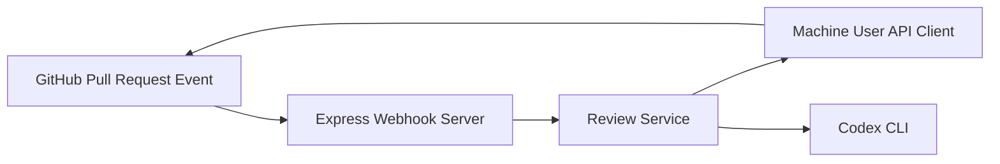
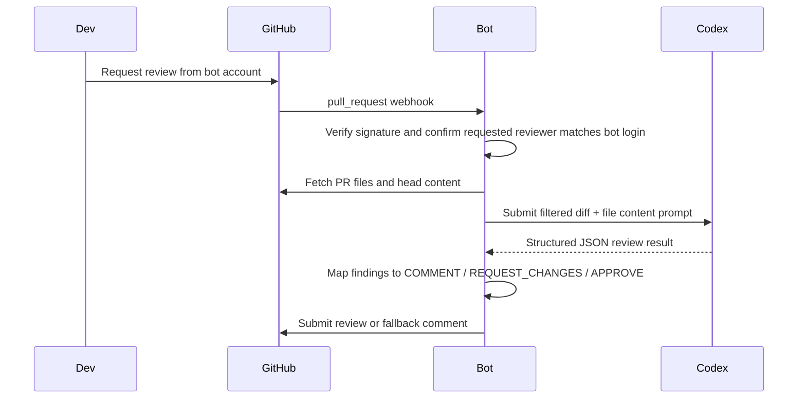

# Architecture

## System Overview

## Core Components

- **Webhook server** verifies `x-hub-signature-256`, accepts `pull_request` webhooks, and dispatches asynchronous review work.
- **Review service** only runs when `action === review_requested` and `requested_reviewer.login` matches the configured bot login, then filters files, builds prompts, invokes Codex, applies deterministic decision logic, and publishes results.
- **GitHub review platform** authenticates with the machine-user token, fetches changed files and head content, checks idempotency markers, and submits reviews or fallback comments.
- **Codex runner** shells out to `codex exec` with a JSON Schema file so the final response is machine-validated before any GitHub action is taken.

## Sequence Diagram

## MVP Design Decisions

- The service is a single root TypeScript app instead of a monorepo split.
- Webhook handling is asynchronous after signature verification so GitHub receives a fast `202 Accepted`.
- Review execution is explicit: the bot only runs when the configured reviewer account is requested.
- Codex output is trusted only after JSON Schema validation.
- Idempotency uses a marker tied to `(repo, pull request, head SHA)` and checks both prior reviews and issue comments.
- Invalid inline comment targets are moved into the top-level review body instead of failing the entire review.

## Boundaries

- The bot does not execute code from the pull request.
- The bot only reviews files that match the configured language filter and have patch hunks GitHub can comment on.
- Background queues, repo-level config, and observability dashboards are explicitly out of scope for the MVP.
