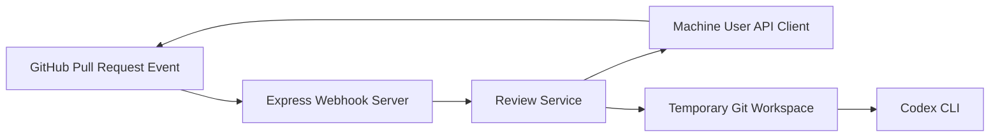
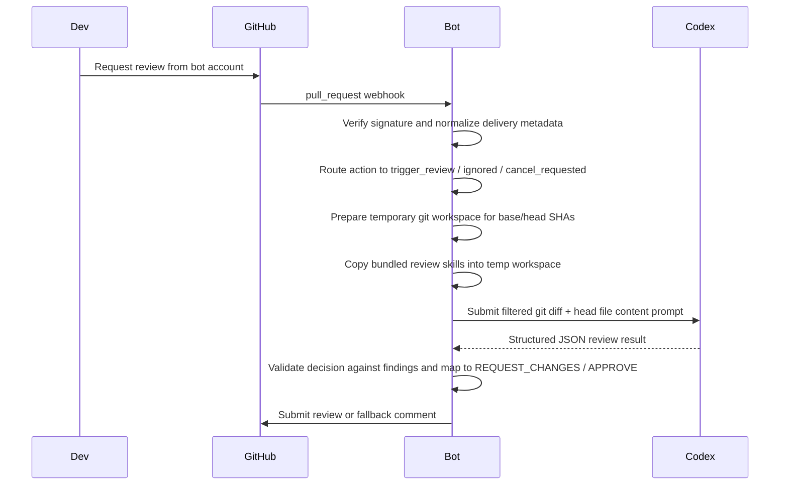

# Architecture

## System Overview

## Core Components

- **Webhook server** verifies `x-hub-signature-256`, normalizes `pull_request` webhook metadata, emits structured lifecycle logs, and dispatches asynchronous review work.
- **Review service** routes every normalized `pull_request` action to one of three outcomes: `trigger_review`, `ignored`, or `cancel_requested`. Only `review_requested` for the configured bot starts a review; `synchronize` is audit-only, and `review_request_removed` best-effort cancels an in-flight run for the same head SHA.
- **GitHub review platform** authenticates with the machine-user token, checks idempotency markers, and submits reviews or fallback comments.
- **Temporary workspace manager** creates an isolated git directory, fetches the exact `baseSha` and `headSha`, checks out the PR head, copies `resources/review-skills/*` into `.agents/skills`, and collects the reviewable diff plus current file contents.
- **Codex runner** shells out to `codex exec --cd <workspace> --sandbox read-only` with a JSON Schema file so the final response is machine-validated before any GitHub action is taken.

## Sequence Diagram

## MVP Design Decisions

- The service is a single root TypeScript app instead of a monorepo split.
- Webhook handling is asynchronous after signature verification so GitHub receives a fast `202 Accepted`.
- Review execution is explicit: the bot only runs when the configured reviewer account is requested.
- `synchronize` events are logged for audit but never auto-trigger a review.
- `review_request_removed` requests a best-effort in-memory cancellation for an in-flight run on the same head SHA.
- Codex output is trusted only after JSON Schema validation.
- Idempotency uses a marker tied to `(repo, pull request, head SHA)` and checks both prior reviews and issue comments.
- Invalid inline comment targets are moved into the top-level review body instead of failing the entire review.

## Boundaries

- The bot does not execute code from the pull request.
- The bot only reviews files that match the configured language filter and have patch hunks GitHub can comment on.
- Background queues, repo-level config, and observability dashboards are explicitly out of scope for the MVP.
