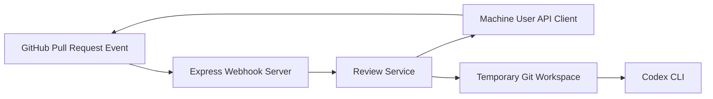
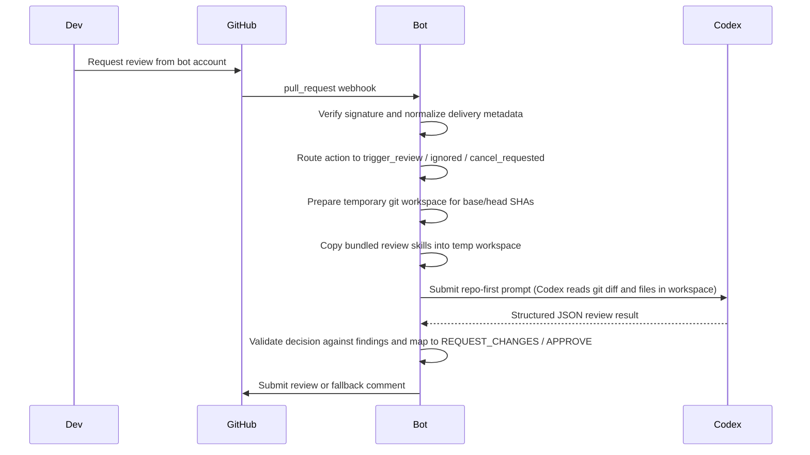

# Architecture

## System Overview

```mermaid
flowchart LR
  GitHub[GitHub Pull Request Event] --> Webhook[Express Webhook Server]
  Webhook --> Service[Review Service]
  Service --> GitHubAPI[Machine User API Client]
  Service --> Workspace[Temporary Git Workspace]
  Workspace --> Codex[Codex CLI]
  GitHubAPI --> GitHub
```

## Core Components

- **Webhook server** verifies `x-hub-signature-256`, normalizes `pull_request` webhook metadata, emits structured lifecycle logs, and dispatches asynchronous review work.
- **Review service** routes every normalized `pull_request` action to one of three outcomes: `trigger_review`, `ignored`, or `cancel_requested`. It enqueues all work into a single in-process global FIFO queue shared across repositories, triggers reviews only for `review_requested` (bot requested), ignores `synchronize`, and supports best-effort cancellation.
- **GitHub review platform** authenticates with the machine-user token, checks idempotency markers, and submits reviews or fallback comments.
- **Temporary workspace manager** creates a temporary git directory, fetches the exact `baseSha` and `headSha` with ancestry for merge-base comparison, checks out the PR head, replaces the PR-owned `.agents` tree with trusted `resources/review-skills/*` in `.agents/skills`, and prepares deterministic refs (`refs/codex-review/base` and `refs/codex-review/head`) for in-workspace git inspection.
- **Codex runner** shells out to `codex exec --cd <workspace> --sandbox read-only` with a JSON Schema file so the final response is machine-validated before any GitHub action is taken, and supports hard process cancellation for explicit cancellation requests.

## Sequence Diagram

```mermaid
sequenceDiagram
  participant Dev
  participant GitHub
  participant Bot
  participant Codex

  Dev->>GitHub: Request review from bot account
  GitHub->>Bot: pull_request webhook
  Bot->>Bot: Verify signature and normalize delivery metadata
  Bot->>Bot: Route action to trigger_review / ignored / cancel_requested
  Bot->>Bot: Prepare temporary git workspace for base/head SHAs
  Bot->>Bot: Copy bundled review skills into temp workspace
  Bot->>Codex: Submit repo-first prompt (Codex reads git diff and files in workspace)
  Codex-->>Bot: Structured JSON review result
  Bot->>Bot: Validate decision against findings and map to REQUEST_CHANGES / APPROVE
  Bot->>GitHub: Submit review or fallback comment
```

## MVP Design Decisions

- The service is a single root TypeScript app instead of a monorepo split.
- Webhook handling is asynchronous after signature verification so GitHub receives a fast `202 Accepted`.
- Review execution is queue-driven: all review requests are serialized through one global FIFO worker.
- `synchronize` events are always ignored and never auto-trigger a review.
- Initial review uses a 2-phase Codex flow; re-review uses a single fast phase focused on delta from the latest successful bot-reviewed SHA.
- Each run fetches PR discussion history from GitHub (GraphQL-first with REST fallback), stores it as `pr-review-comments.md`, and prompts Codex to read it from workspace.
- `review_request_removed` requests a best-effort in-memory cancellation for the active run and removes queued work for that PR.
- PR issue reactions are updated best-effort to reflect review state: `eyes` during review, `hooray` for `APPROVE`, `confused` for `REQUEST_CHANGES`, and `laugh` for ignored requests that never enter a review run. `approved_before`, cancellation, and failure do not change the reaction.
- Approved lock skips repeat requests only for the same head SHA after a bot `APPROVE` when enabled. New head SHAs remain eligible for manual review. Ignored requests use reason `approved_before`.
- Initial review and full-PR fallback use `base...head` (merge-base to head), matching GitHub PR diff semantics; re-review deltas compare previous reviewed SHA to current head directly.
- GitHub authentication is supplied through fetch-only environment configuration, never remote URLs stored in `.git/config`. Codex receives only runtime/authentication/proxy environment keys, not service secrets; model shell commands inherit no environment.
- Bot-owned metadata paths are replaced without following PR symlinks before writing. Workspace cleanup also covers discussion fetch/persistence failures.
- Codex output is trusted only after JSON Schema validation.
- Idempotency uses a marker tied to `(repo, pull request, head SHA, delivery run token)` and checks both prior reviews and issue comments.
- Invalid inline comment targets are moved into the top-level review body instead of failing the entire review.

## Boundaries

- Prompts prohibit executing PR code, tests, or dependency installation. Codex commands use a read-only sandbox; this is not a guarantee that all readable host files are isolated. Use a dedicated OS account and limit access to secrets on the host.
- The bot only reviews files that match the configured language filter and have patch hunks GitHub can comment on.
- Distributed queues, durable state recovery after process restart, and observability dashboards are explicitly out of scope for the MVP.
